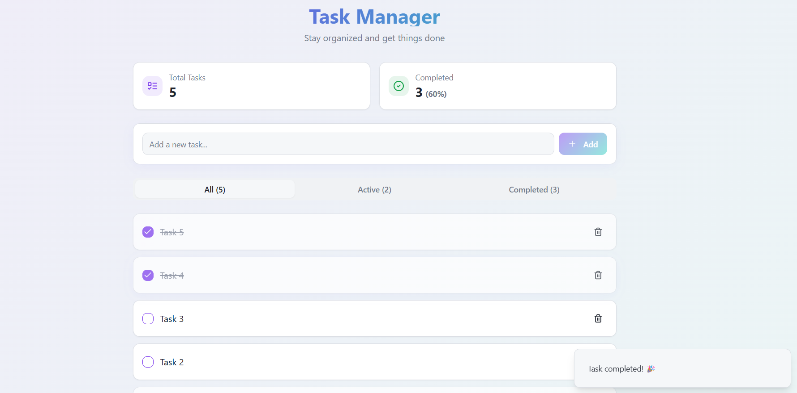
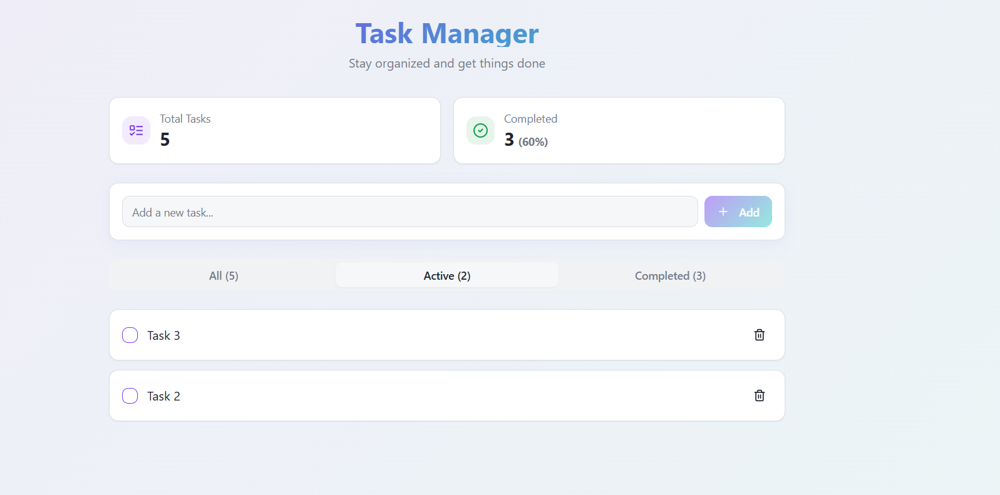
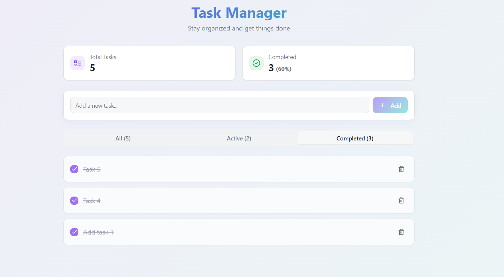

# 🚀 Welcome to **Appsian Task Manager**

A modern, minimal, and responsive **Task Management Dashboard** built with **React, TypeScript, Tailwind CSS, and shadcn-ui**.  
This project was developed as part of the **Appsian Logical Assignment** for efficient task tracking and productivity.

---

## **Bonus Section - **

👉 **[View Live App deployed on VERCEL](https://task-manager-appsian-2025.vercel.app/)** 

Implemented task filtering based on their status completed/pending/all.

Designed using Tailwind,Bootstrap and custom css.

---

## 💻 Work Locally with Your Preferred IDE

If you want to work locally using your own development environment, clone this repository and push changes freely.

### 🧰 Prerequisites

Ensure that **Node.js** and **npm** are installed on your system.  
You can install them easily using [nvm (Node Version Manager)](https://github.com/nvm-sh/nvm#installing-and-updating).

---

### 📸 Screenshots





---

### ⚙️ Setup Instructions

```bash
# Step 1: Clone the repository using the project's Git URL.
git clone <YOUR_GIT_URL>

# Step 2: Navigate to the project directory.
cd <YOUR_PROJECT_NAME>

# Step 3: Install the necessary dependencies.
npm install

# Step 4: Start the development server with auto-reloading and live preview.
npm run dev
